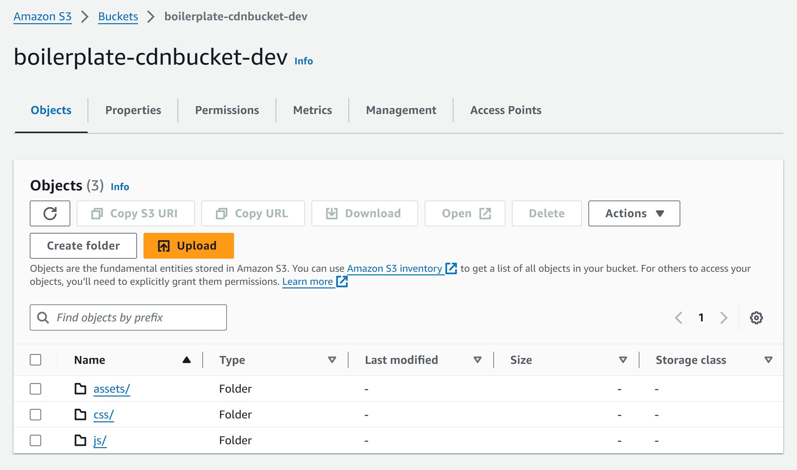

### What is Serverless Framework?
If you played around with the code-base, you will have seen the `serverless.yml` file in `backend`. It is a IAS
(Infrastructure As Code) Framework, used to define ressources in AWS or other providers. Open the file and let's 
look at how it works

### Deploying a single function
take a look at the functions tab:
```yml serverless.yml
functions:
  webapp:
    handler: app.lambda_handler
    timeout: 30 
    events:
      - http: ANY /
      - http: 'ANY /{proxy+}'
```
Here, `webapp` is simply the name we gave to this Lambda function, each other name will create another function. The event
describes how this function is invoked, in our case it is through an HTTP request. This means, that alongside the function,
also an AWS API Gateway is created. 


Besides that we get integrated logs using AWS CloudWatch.

Now look at the handler. Normally, lambda_handler, should be a function taking in an event and context object and processing
it accordingly. Since we already use Flask and want to continue using it, we will use a library called `serverless-wsgi`.
Open `app.py`. At the bottom of the file, you will see how we wrap our application and define the handler function
we point to in our YAML file.

```python app.py
if __name__ == "__main__":
    app.run(debug=True, port="8080")

else:
    # --- SLS (Lambda) ---
    import serverless_wsgi

    def lambda_handler(event, context): 
	    return serverless_wsgi.handle_request(app, event, context)
```

### Secrets and Permissions
Obviosly we don't want to reveal our secret keys inside the YAML configuration. By calling `useDotenv: true` at the
top of the file we allow serverless to read our keys and access them using `${env:KEY}`. An important thing to note,
is that our `.env` file is NOT copied to our Lambda function for security reasons. This means, that all the environment
variables we want to give to the code, have to be passed manually. This we do in provider.environments:

```yml serverless.yml
provider:
  environment:
    ...
    GITHUB_CLIENT_ID: ${env:GITHUB_CLIENT_ID}
    GITHUB_CLIENT_SECRET: ${env:GITHUB_CLIENT_SECRET}
    more stuff...

```

Besides environment variables and come configuration, here we also define the permissions to other AWS ressources, since
we don't want to manually install and setup the AWS CLI on the lambda function. 

```yml serverless.yml
  iamRoleStatements:
    # allow only to access our table but all email identities
    - Effect: Allow
      Action:
        - dynamodb:*
      Resource: "arn:aws:dynamodb:${self:provider.region}:*:table/${self:provider.environment.DYNAMO_TABLE_NAME}"
    - Effect: Allow
      Action:
        - ses:SendEmail
        - ses:SendRawEmail
      Resource: "*"
```

### Domain and SSL
Follow [this video](https://www.youtube.com/watch?v=JIKmsr1kuUo), while skipping the step of buying a new domain.
If deploying on the edge (meaning multiple endpoints close to the user), the certificate MUST be in us-east-1, since this
is the the only region CloudFront (the Content Delivery Network service by AWS) supports. We will use regional deployment,
this means use the region you have used for the rest of your ressources.

Now we will create a Custom Domain in AWS API Gateway and integrate it. For that we can use the `serverless-domain-manager`
plugin. It is configured inside the custom tab:

```yml serverless.yml
  customDomain:
    domainName: ${env:DOMAIN}
    stage: ${self:provider.stage}
    basePath: ''
    createRoute53Record: true
    createRoute53IPv6Record: true
    endpointType: REGIONAL
    apiType: rest
    hostedZoneId: ${env:HOSTED_ZONE_ID}
    certficateArn: ${env:CERTIFICATE_ARN}
```

For that we will have to set 3 more keys in our `.env` file:

- domainName should be a domain like api.ivanbokarev.top, that is controlled by Route53
- HOSTED_ZONE_ID should be the ID of the Route53 hosted zone 
- certificateArn should be the ARN (Amazon Ressource Name) for the certificate you just created

Now you can call `sls create_domain`. This will use the set information to create the new Domain.

If you want to delete it again (after you have already removed the Lambda function with `sls remove`), you 
can simply call `sls delete_domain`

### Configuring the CDN 
If we wanted to, we could simply serve our static files through Flask. But just like we would not do it. This
is not only dumb for monetory reasons, since we will pay for Lambda executions and API-Gateway, but is also 
way slower. To solve this issue we will use CloudFront, the CDN service from AWS. 

The first step to serving files, will be to upload them to an S3 bucket (file storage on AWS), after which we
will set it as the source for our CDN. Looking in the ressources tab, you will see CloudFormation syntax. This
is the IAS code native to AWS, and can be used in `serverless.yml` to define custom ressources.

```yml serverless.yml
resources:
  Resources:
    StaticSite:
      Type: AWS::S3::Bucket      
      Properties:
        BucketName: ${self:custom.s3Bucket}
        WebsiteConfiguration: 
          IndexDocument: index.html
          ErrorDocument: error.html
        PublicAccessBlockConfiguration:
          BlockPublicAcls: false
          BlockPublicPolicy: false
          IgnorePublicAcls: false
          RestrictPublicBuckets: false

    StaticSiteS3BucketPolicy:
      Type: AWS::S3::BucketPolicy
      Properties:
        Bucket:
          Ref: StaticSite
        PolicyDocument:
          Statement:
            - Sid: PublicReadGetObject
              Effect: Allow
              Principal: "*"
              Action:
                - s3:GetObject
              Resource: arn:aws:s3:::${self:custom.s3Bucket}/*

    CloudFrontDistribution:
      Type: AWS::CloudFront::Distribution
      Properties:
        DistributionConfig:
          DefaultCacheBehavior:
            ViewerProtocolPolicy: allow-all
            TargetOriginId: ${self:custom.s3Bucket}-target
            ForwardedValues:
              QueryString: 'false'
          Enabled: 'true'
          HttpVersion: http2
          Origins:
            - DomainName: ${self:custom.s3Bucket}.s3.amazonaws.com
              Id: ${self:custom.s3Bucket}-target
              CustomOriginConfig:
                HTTPPort: 80
                HTTPSPort: 443
                OriginProtocolPolicy: https-only
```

Now go back to the custom tab to see what variables we have set and are using inside our CloudFormation:

```yml serverless.yml
custom:
  s3Bucket: ${self:service}-cdnbucket-${self:provider.stage}
  s3LocalPath: ./static

  s3Sync:
    - bucketName: ${self:service}-cdnbucket-${self:provider.stage}
      localDir: ./static
```
Here we define a name for our bucket. Besides that there is an tab for the s3Sync plugin. It allows to 
automatically sync our files to a bucket, when later deploying or removing our application. To it, we give
the same name, of our bucket as the `bucketName`, as well as a `localDir` pointing to our static folder, which
we will deploy.

```yml serverless.yml
plugins:
  ...
  - serverless-s3-sync
```

This is how your S3 bucket will look like


One thing still remains to do: change our static files source to the CDN. For that, we will pass the domain name
of our CloudFront distribution to our application through an environment variable.

```yml serverless.yml
provider:
  environment:
    CDN_DOMAIN: !GetAtt CloudFrontDistribution.DomainName
    ...
```

Since we don't want to change the code manually and continue using the url_for function inside our Jinja templates,

```html _base.html
<link rel="stylesheet" href="{{ url_for('static', filename='css/base.css')}}">
```

we will need to overwrite the jinja function. Open `app.py` and go to the bottom of the file, to see, how we 
point to the CloudFront domain, if it is requesting static content.

```python app.py
    from flask import url_for as flask_url_for
    cloudfront_domain = os.getenv("CDN_DOMAIN", "/")

    def url_for(endpoint, **values):
        if endpoint == 'static':
            filename = values.get('filename')
            if filename:
                return "https://" + os.path.join(cloudfront_domain, filename)
        return flask_url_for(endpoint, **values)

    app.jinja_env.globals['url_for'] = url_for
    print(f"Sending /static to {cloudfront_domain}", flush=True)
```


### Deploying
Before starting go to provider and change the region to the one you used for the rest of your ressources.
Now you can call `sls deploy`. This will automatically create all the ressources you have defined