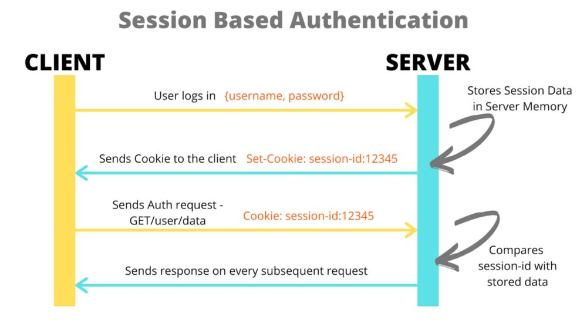

### theory behind authentication
Quick primer: how does basic authentication using tokens work? Once the user logs in successfully, he
receives a token by which he can be identified.
This token is saved in the session, in our case a secure cookie. 
Once the user switches the page, this cookie is read by the server,
which allows the server to authenticate the user since it now knows who he is,
since this cookie can't be changed unless you reveal your secret key.


source: https://javascript.plainenglish.io/react-native-cookie-authentication-83ef6e84ba70

### implementing OAuth
Now the next logical step would be to build a simple email login page and do this manually, but we don't.
Instead we use OAuth: the user logs in with another provider like Google or GitHub with their existing
accounts. The provider then generates the token themselves and gives it to us, so we can access information
about the user like his email. Why do we do this? Well, originally OAUTH was created for app-developers to
perform actions on behalf of a user, learn more in [this 5 minute video](https://www.youtube.com/watch?v=KT8ybowdyr0).
However, the main selling point is the user experience: it is much easier to have one Google account which
you use to login everywhere instead of creating hundrets of separate accounts.

How does this work? First we need to create a new application at an OAuth provider like in our case GitHub and 
configure a callback adress. This is where the user will be sent once he is done logging in. 
For GitHub follow [this video](...) and use ``http://localhost/**`` for local development or your domain name
once you have deployed your application.


Open ``bp_auth.py```:
```python bp_auth.py
# --- OAuth setup ---
CLIENT_ID = os.getenv("GITHUB_CLIENT_ID")
CLIENT_SECRET = os.getenv("GITHUB_CLIENT_SECRET")

oauth = OAuth(app)
github = oauth.register(
    name="github",
    client_id=CLIENT_ID,
    client_secret=CLIENT_SECRET,
    access_token_url="https://github.com/login/oauth/access_token",
    access_token_params=None,
    authorize_url="https://github.com/login/oauth/authorize",
    authorize_params=None,
    api_base_url="https://api.github.com/",
    client_kwargs={"scope": "user:email"},
)
```

Here you can see that we load the "GITHUB_CLIENT_ID" and "GITHUB_CLIENT_SECRET" from our envrionment variables.
Get them from your GitHub application overview and add them to our ``.env`` file.

Now let's look at the routes managing the authentication. If a user tries to access a route, which he is not authorized to 
use, or manually clicks the sign-up button, he will be redirected to "/authenticate".

```python bp_auth.py
@app.get("/authenticate")
def signupRoute():
    next = request.args.get("next", "")
    info_log("\n\nnext (authenticate): " + str(next) + "\n\n")
    return github.authorize_redirect(f"{request.host_url}callback{f'?next={next}' if next else ''}")
``` 

From here he is once again redirected to GitHub using the ``authorize_redirect`` function. To it, we pass a callback URL, which
consists of our host, the "/callback" route and a "next" query parameter which displays where the user was planning to
go originally. This callback URL *HAS* to match the pattern, that we provided in our OAuth application settings, since GitHub
doesn't want the user to be sent to malicious sites, if the secret keys are compromised.

Once the user has logged in, he is redirected to our "/callback" route. Note, that besides the "next"
query parameter we provided, GitHub also added a "code" one. This is a token which, together with the client secret, we can
exchange for an access token. This access token is "like an API key" and allows us to fetch data about the user like his email.

```python bp_auth.py
@app.get("/callback")
def callbackRoute():
    next = request.args.get("next", "/home/authed")
    info_log("\n\nnext (callback): " + str(next) + "\n\n")

    code = request.args.get("code", None)

    if code != None:
        access_token = exchange_code_for_access_token(code, CLIENT_ID, CLIENT_SECRET)
        session["access_token"] = access_token

        user_info = get_user_info(access_token)
        email = user_info[0]["email"] 
        session["email"] = email

        info_log(f"Signing in user with email {email}")
        add_user(email)
        
        return redirect(next)

    else:
        error_log("No code found in callback")
        return redirect("/")
```

If you look into our ``req.py`` file, you can see the two functions performing these actions.  

```python req.py
def exchange_code_for_access_token(code, client_id, client_secret):
    payload = {
        "client_id": client_id,
        "client_secret": client_secret,
        "code": code,
    }

    headers = {
        "Accept": "application/json",
    }

    response = requests.post(
        "https://github.com/login/oauth/access_token", json=payload, headers=headers
    )

    if response.status_code == 200:
        access_token = response.json()["access_token"]
        return access_token
    
    else:
        return None
    

def get_user_info(access_token):
    if access_token:
        headers = {
            "Authorization": f"Bearer {access_token}",
            "Accept": "application/vnd.github.v3+json",
        }

        response = requests.get("https://api.github.com/user/email", headers=headers)

        if response.status_code == 200:
            data = response.json()
            return data

    return None
```

Having the user saved on GitHubs servers is good and all, but we want to have control over that information as well.
For that we will call the ``add_user`` function which will save this user to our database. Read the next chapter to 
learn how