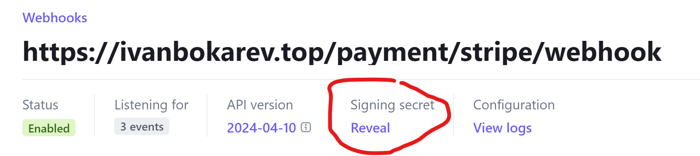
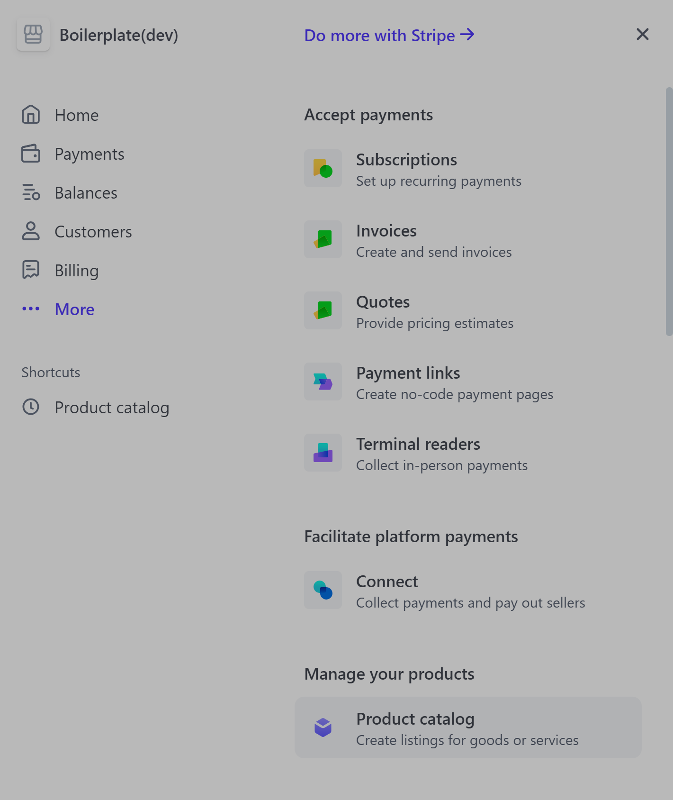

### Stripe
If you want to make money, you need to charge users. Thankfully, this is as easy as ever. Providers like 
Stripe take care of processing payments with any method imaginable. Simply create an account on Stripe, this
will have test mode enabled by default, meaning you can pay here without being charged. Also make sure you have
the Stripe CLI (see installation) installed, we will need it later.

Get the STRIPE_SECRET_KEY and add it to your `.env` file


Once again, we don't have to build our own page.
We Simply redirect the user to Stripe, where he can pay and come back to our site. 

# building our webhook
In the background, stripe will charge the user, and will inform us when certain events like
a successfull or canceled payment happens, by communicating with our webhook. A webhook is simply said
an endpoint where Stripe can send a request to. Open ``payment_bp.py`` and take a look at the "/stripe/webhook" route:

```python payment_bp.py
# --- Webhook ---
@payment_bp.post("/stripe/webhook")
def stripeWebhookRoute():
    payload = request.data
    sig_header = request.headers['STRIPE_SIGNATURE']


    # verify event signature (so that only stripe can send you events)
    try:
        event = stripe.Webhook.construct_event(payload, sig_header, os.getenv("STRIPE_ENDPOINT_SECRET"))
    except ValueError as e:
        raise f"Invalid Payload: {e}"
    except stripe.error.SignatureVerificationError as e:
        raise f"Invalid Signature: {e}"
    

    # user has finished checkout but payment might not have gone through yet
    if event["type"] == "checkout.session.completed":
        current_app.logger.info("User has finished the checkout")

    # when the payment has gone through successfully
    elif event["type"] == "payment_intent.succeeded":
        package_id = event["data"]["object"]["metadata"]["package_id"]
        email = event["data"]["object"]["metadata"]["email"]
        charge_id = event["data"]["object"]["latest_charge"]
        current_app.logger.info(f"Webhook received, that user with email {email} has bought package number {package_id}")

        try:
            set_user_package(email, package_id)
            
        except Exception as e:
            stripe.Refund.create(charge=charge_id)
            current_app.logger.error(f"Error setting user package for email {email}: {str(e)}. Charge {charge_id} refunded.")
            send_plain_email(
                email_adress=email,
                subject="Order Processing Error",
                text=REFUND_TEXT
            )
            
            return jsonify(success=True)
            
        current_app.logger.info(f"Webhook received, that user with email {email} has bought package number {package_id}")
        send_plain_email(
                email_adress=email,
                subject="You are ready to ship!",
                text=SUCCESS_TEXT
            )


    # when a payment failed
    elif event["type"] == "payment_intent.payment_failed":
        email = event["data"]["object"]["metadata"]["email"]
        send_plain_email(
            email_adress=email,
            subject="Your payment didn't go through :(",
            text=CANCEL_TEXT
        )

    # other events
    else:
      current_app.logger.error(f"Unhandled event type {event['type']}")


    return jsonify(success=True)
```

Here we receive a message from Stripe and first validate it using our STRIPE_ENDPOINT_SECRET, which you will
have to set inside ``.env``. This ensures, that only Stripe can send to this endpoint



After that we handle events accordingly like:
- sending an email 
- calling ``set_user_package`` function (or refunding if it fails)


As you can see, we can retrieve information about 
- which user has bought something (email)
- which package that user has bought (package_id)
from the metadata.


# creating the checkout
Both of this is set when creating the Checkout Session in "/checkout":

```python payment_bp.py
@payment_bp.get("/checkout/<int:package_id>")
@login_required
def checkoutRoute(package_id:int=1):
    # check if already bought something
    _, payed = check_user_status()
    if payed:
        info_log("User has already payed")
        return redirect("/home/payed")
    

    email = session.get("email")
    info_log(f"Creating Checkout for user with email {email} buying package number {package_id}")


    checkout_session = stripe.checkout.Session.create(
        payment_method_types=["card", "paypal"],
        line_items=[{"price": stripe_packages[package_id], "quantity": 1}],
        mode="payment",
        success_url=f"{request.host_url}payment/thanks" + "?session_id={CHECKOUT_SESSION_ID}",
        cancel_url=f"{request.host_url}payment/cancel",
        metadata={
            "email": email,
            "package_id": package_id
        },
        payment_intent_data={
            "metadata": {
                "email": email,
                "package_id": package_id
            }
        }
    )

    return redirect(checkout_session.url)
``` 

What is also interesting is the line_items key. Here we will need to provide an id of an item which we create in Stripe
under More -> Product Catalog



Once you have created two products (one for each package) and have thereby set information such as price, you can
add it to our ``stripe_packages`` array and map the items to their "package_ids". Create two of those products and
add them to the `.env` file.

```python payment_bp.py
stripe_packages = {
    1: os.getenv("STRIPE_PACKAGE_ONE, ""),
    2: os.getenv("STRIPE_PACKAGE_ONE, "")
}
```

### connecting Stripe to our webhook
Lets get back to the webhook part. How does Stripe know where it is located? Once you have deployed your application at it
is accessible on the World Wide Web (www), you can set the IP or domain name of it inside the Stripe Settings. While we work
locally, however, we will use a technique called pooling. This means we will regularly ping the Stripe servers and see if any
updates came through. This is made possible using the Stripe CLI.

```bash
stripe listen --forward-to localhost:8080/payment/stripe/webhook
```

This command will forward the Stripe Requests to our application running locally on port 8080. Note that this is the case
when running locally using ``bash local.sh`` and not while inside Docker (see structure).

Later once we have deployed to a domain, you can provide the URL to your webhook inside 
the Stripe interface.
When an event occurs, Stripe will automatically send a request there, without you needing to use the Stripe CLI. 
There you will have the option to receive only the events you need, these are:
- `checkout.session.completed` to see when the user filled out the checkout from
- `payment_intent.succeeded` to see when the payment has actually gone through
- `payment_intent.failed` if the payment failed

As you might remember, we used the ``send_email`` functions to notify the user about his payments going through or being
cancelled. Read the next chapter on emails to see how we accomplish this