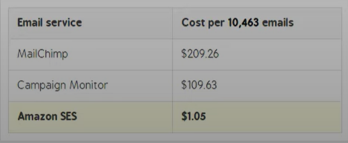

Emails are important to communicate with your users. We will not set up an email list management tool here, 
these will be transactional emails. For that we will go back to AWS of course - SES (Simple Email Service)
is here to help!




### Setting up SES
For sending emails you will need a domain. 
If you don't have one yet, buy one directly in AWS or just "transfer" the bought domain to Route53 
(The DNS managment service by AWS) using nameservers.
For example if you got your domain from GoDaddy, follow [this video](https://www.youtube.com/watch?v=hRSj2n-XKGM),
the process is the same with other providers. 

Once our domain is added to Route53, we can use it to create and validate an identity in SES itself.
This can either be single email adress (a@test.com) or a the domain (test.com) which covers all the possible adresses. 
Choose an approach and follow the first 90 seconds of [this video](https://www.youtube.com/watch?v=VWt43MXhuk4).


### Sending Emails with Python
SES offers two ways of sending emails: 
1. through the SMTP interface (Simple Mail Transfer Protocol, just imagine this as the raw request approach) 
2. using the Python SDK
For simplicity we will use the SDK, make sure you followed "database" and configured the credentials.

Now open ``mail.py``, you will see that we can send both text and HTML emails. You will have to create HTML files
and pass them to the function.
```python mail.py
def send_email(email_adress:str, subject:str, body:dict):
    resp = email_client.send_email(
        Destination={
            "ToAddresses": [
                email_adress
            ]
        },
        Message={
            "Body": body,
            "Subject": {
                "Charset": EMAIL_CHARSET,
                "Data": subject
            }
        },
        Source=os.getenv("FROM_EMAIL")
    )


def send_plain_email(email_adress:str, subject:str, text:str):
    send_email(
        email_adress=email_adress,
        subject=subject,
        body={
            "Text": {
                "Charset": EMAIL_CHARSET,
                "Data": text
            }
        }
    )

def send_html_email(email_adress:str, subject:str, html_string:str):
    send_email(
        email_adress=email_adress,
        subject=subject,
        body={
            "HTML": {
                "Charset": EMAIL_CHARSET,
                "Data": html_string
            }
        }
    )
```

Do not forget to fill the "FROM_EMAIL" key to `.env`, it has to match the identity you created.


### Writing the Email HTML
Programmatic emails are a pain in the ass. 
Instead of writing HTML tables, you can use an open-source library called 
[React Email](https://github.com/resend/react-email).
Here we can define our email structure with beatifully styled React components and then compile them into a plain HTML
file. You can easily implement this yourself by following their documentation


### Receiving emails
The setup we have is for sending emails only. You can configure SES to handle emails:
- programmaticaly (it will trigger a Lambda function which performs code and has access to the email)
- like an inbox with an AWS Workmail setup
