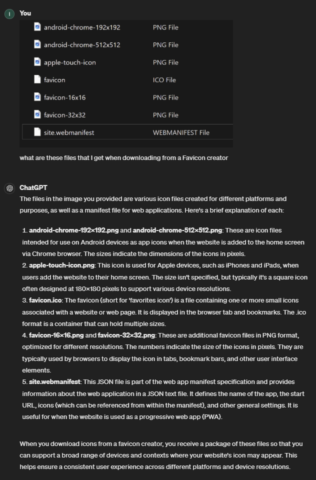

Unfortunately there is a bunch more to running a website besides building the application.
Fortunately they are MOSTLY boilerplate.

### SEO
For Search Engine Optimization the most imortant part (along with actually good content) are the meta tags. Open
``_base.html``, you will see the most important meta tags are created and filled programmatically.
Now open ``app.py`` and go down to our context manager (it inserts variables into ALL of our templates):

```python app.py
@app.context_processor
def injectProcessor():
    ...
    return dict(
        user_logged_in=user_logged_in, 
        user_payed=user_payed,
        html_lang="en",
        locale="en_US",
        description=os.getenv("DESCRIPTION", ""),
        title=os.getenv("TITLE", ""),
        url=request.host_url,
        author=os.getenv("PERSONAL_NAME", ""),
        name=os.getenv("APPLICATION_NAME", ""),
        type="website",
        keywords=os.getenv("KEYWORDS", ""),
        og_img_path="./static/assets/hero.png"
    )
```

You can see that all of the personalized meta information is pulled from ``.env``, fill it accordingly. 
Also change the image path to the one you want to be displayed, when you share your website on social media.

Tip: when setting the title and description, you can follow the length guidelines in [this tool](https://rankmath.com/tools/meta-tag-analyzer/).

### Terms and Conditions / Privacy Agreement
In the footer of the page you have links to these 2 things. 

They are written by ChatGPT. Use this as a placeholder
in development until you create a correct one for you. I do NOT take any liability for these documents.

Just like the meta tags, these use information from `.env`.

```python app.py
def process_markdown(filepath):
    with open(filepath, "r", encoding="utf-8") as f:
        md = markdown.markdown(
            f.read()
            .replace("COMPANY NAME", os.getenv("COMPANY_NAME", "-"))
            .replace("APPLICATION NAME", os.getenv("APPLICATION_NAME", "-"))
            .replace("WEBSITE URL", request.host_url)
            .replace("CURRENCY", os.getenv("CURRENCY", ""))
        )
    
    return md


@app.get("/toc")
def tocRoute():
    return render_template("message.html", heading="Terms and Conditions", body=process_markdown("./static/texts/toc.md"))

@app.get("/privacy")
def privacyRoute():
    return render_template("message.html", heading="Privacy Agreement", body=process_markdown("./static/texts/privacy.md"))
```

### Favicon
The favicon is the little icon that gets displayed in your browser. Interestingly it is more than that.
Once you create a favicon from a normal image in [this tool](https://favicon.io/favicon-converter/), you will
get a bunch of different files, I will just let ChatGPT explain:



Simply extract the metioned files into ``static/assets/favicon``    