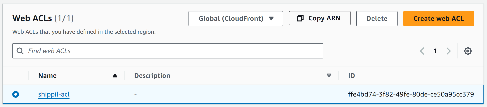

### Disclaimer:
I am gonna be honest: this chapter is going to be VERY confusing if doing this for the first time. While the
Cloud has granted us the ability to build as quick as ever, it is over-engineered in some sense.

### The Architecture
The main building block of our Stack is going to be a Lambda function. You upload a piece of code, and are only
billed for when it is run, thus it is "serverless". To invoke (run) this piece of code, we will use the API
Gateway service, which translates a request into a format the Lambda function can process (that format
will again be processed into a format Flask can read, more on this later). Since serving static files is
not only slow but also more expensive, we will separate and upload them to S3 (file storage). From there
we will directly server using CloudFront, the CDN service by AWS, to offer caching and compression.
To enhance security, we also Integrate WAF:
an application firewall which can handle things such as rate-limiting, blocking bots, or known malicious IPs.


### What is Serverless Framework?
If you played around with the code-base, you will have seen the `serverless.yml` file in `backend`. It is a IAS
(Infrastructure As Code) Framework, used to define ressources in AWS or other providers. Open the file and let's 
look at how it works

### Deploying a single function
take a look at the functions tab:
```yml serverless.yml
functions:
  webapp:
    handler: app_lambda.lambda_handler
    timeout: 30 
    events:
      - http: ANY /
      - http: 'ANY /{proxy+}'
```
Here, `webapp` is simply the name we gave to this Lambda function, each other name will create another function. The event
describes how this function is invoked, in our case it is through an HTTP request. This means, that alongside the function,
also an AWS API Gateway is created. 


Besides that we get integrated logs using AWS CloudWatch.

Now look at the handler. Normally, lambda_handler, should be a function taking in an event and context object and processing
it accordingly. Since we already use Flask and want to continue using it, we will use a library called `serverless-wsgi`.
Open `app_lambda.py`, there you will see how we wrap our application and define the handler function
we point to in our YAML file.

```python app_lambda.py
import serverless_wsgi

def lambda_handler(event, context): 
  return serverless_wsgi.handle_request(app, event, context)
```

### Secrets and Permissions
Obviously we don't want to reveal our secret keys inside the YAML configuration. By calling `useDotenv: true` at the
top of the file we allow serverless to read our `.env` file and access it using `${env:KEYNAME}`. An important thing to note,
is that our `.env` file will NOT be copied to our Lambda function for security reasons. This means, that all the environment
variables we want to give to the code, have to be passed manually. This we do in provider.environments:

```yml serverless.yml
provider:
  environment:
    ...
    GITHUB_CLIENT_ID: ${env:GITHUB_CLIENT_ID}
    GITHUB_CLIENT_SECRET: ${env:GITHUB_CLIENT_SECRET}
    more stuff...

```

Besides environment variables and some configuration, here we also define the permissions to other AWS ressources.
Thereby we allow interaction with other services without giving full controll and escalating breaches. 

```yml serverless.yml
  iamRoleStatements:
    # allow only access to our table
    - Effect: Allow
      Action:
        - dynamodb:*
      Resource: "arn:aws:dynamodb:${self:provider.region}:*:table/${self:provider.environment.DYNAMO_TABLE_NAME}"

    # allow to send emails through SES
    - Effect: Allow
      Action:
        - ses:SendEmail
        - ses:SendRawEmail
      Resource: "*"
```

### Configuring WAF
If you want to Integrate a WAF into your application, you will first create an ACL and define rules and settings.
An ACL costs 5$ (plus 90 cents per million requests), but can be associated to multiple ressources. Note that
an ACL can either be global (like in our case) if you want to integrate it with CloudFront or regional for local
ressources like API Gateway" or Elastic Load Balancers. Watch [this introduction to WAF](https://www.youtube.com/watch?v=kVntHMtXHLw&t=833s)
before creating your own global distribution, and adding its arn as "ACL_ARN" to the `.env` file. We will reference
it when creating the CloudFront distribution later



### Configuring the CDN 
The first step to serving files, will be to upload them to the S3 bucket - We
will set it as the source in CloudFront. Looking in the ressources tab, you will see CloudFormation syntax. This
is the IAS code native to AWS, and can be used in `serverless.yml` to define custom ressources.

```yml serverless.yml
resources:
  Resources:

    # public bucket and according policy
    StaticSite:
      Type: AWS::S3::Bucket      
      Properties:
        BucketName: ${self:custom.s3Bucket}
        PublicAccessBlockConfiguration:
          BlockPublicAcls: false
          BlockPublicPolicy: false
          IgnorePublicAcls: false
          RestrictPublicBuckets: false

    StaticSiteS3BucketPolicy:
      Type: AWS::S3::BucketPolicy
      Properties:
        Bucket:
          Ref: StaticSite
        PolicyDocument:
          Statement:
            - Sid: PublicReadGetObject
              Effect: Allow
              Principal: "*"
              Action:
                - s3:GetObject
              Resource: arn:aws:s3:::${self:custom.s3Bucket}/*

    # CDN
    CloudFrontDistribution:
      Type: AWS::CloudFront::Distribution
      Properties:
        DistributionConfig:
          WebACLId: !Sub ${env:ACL_ARN}
          DefaultCacheBehavior:
            ViewerProtocolPolicy: allow-all
            TargetOriginId: ${self:custom.s3Bucket}-target
            ForwardedValues:
              QueryString: 'false'
              Headers:
                - 'Origin'
                - 'Access-Control-Request-Headers'
                - 'Access-Control-Request-Method'

            Compress: 'true'
            DefaultTTL: 86400 # 1 day
            MaxTTL: 31536000 # 1 year
            MinTTL: 0 

          Enabled: 'true'
          HttpVersion: http2
          PriceClass: PriceClass_100 # Use only the locations that have the lowest cost
          Origins:
            - DomainName: ${self:custom.s3Bucket}.s3.${self:provider.region}.amazonaws.com
              Id: ${self:custom.s3Bucket}-target
              S3OriginConfig: {}


  Outputs:
    CDNDistributionId:
      Description: CDN distribution id.
      Value:
        Ref: CloudFrontDistribution
```

Now go back to the custom tab to see what variables we have set and are using inside our CloudFormation:

```yml serverless.yml
custom:
  s3Bucket: ${self:service}-cdnbucket-${self:provider.stage}
  s3Sync:
    - bucketName: ${self:service}-cdnbucket-${self:provider.stage}
      localDir: ./static
```
Here we define a name for our bucket. Besides that there is an tab for the s3Sync plugin. It allows to 
automatically sync our files to a bucket, when later deploying or removing our application. To it, we give
the same name, of our bucket as the `bucketName`, as well as a `localDir` pointing to our static folder, which
we will deploy.

```yml serverless.yml
plugins:
  ...
  - serverless-s3-sync
```

This is how your S3 bucket will look like


One thing still remains to do: change our static files source to the CDN. For that, we will pass the domain name
of our CloudFront distribution to our application through an environment variable.

```yml serverless.yml
provider:
  environment:
    CDN_DOMAIN: !GetAtt CloudFrontDistribution.DomainName
    ...
```

Since we don't want to change the code manually and continue using the url_for function inside our Jinja templates,

```html _base.html
<link rel="stylesheet" href="{{ url_for('static', filename='css/base.css')}}">
```

we will need to overwrite the jinja function. Open `app.py` and go to the bottom of the file, to see, how we 
point to the CloudFront domain, if it is requesting static content.

```python app.py
from flask import url_for as flask_url_for
cloudfront_domain = os.getenv("CDN_DOMAIN", "/")

def url_for(endpoint, **values):
    if endpoint == 'static':
        filename = values.get('filename')
        if filename:
            return "https://" + os.path.join(cloudfront_domain, filename)
    return flask_url_for(endpoint, **values)

app.jinja_env.globals['url_for'] = url_for
print(f"Sending /static to {cloudfront_domain}", flush=True)
```

Note that we also add the CDN_DOMAIN as an allowed origin inside our CSP header (see extras->security), since
we want to allow our HTML page to also load content from our CDN


### Domain and SSL
Follow [this video](https://www.youtube.com/watch?v=JIKmsr1kuUo), while skipping the step of buying a new domain.
If deploying on the *edge* (meaning multiple endpoints close to the user), the certificate MUST be in us-east-1, since this
is the the only region CloudFront (the Content Delivery Network service by AWS) supports. This means that your Lambda
function will be copied to multiple regions and generate more cost. Otherwise you can create a certificate in the same 
region and deploy to *regional*

Now we will create a Custom Domain in AWS API Gateway and integrate it. For that we can use the `serverless-domain-manager`
plugin. It is configured inside the custom tab:

```yml serverless.yml
  customDomain:
    domainName: ${env:DOMAIN}
    stage: ${self:provider.stage}
    basePath: ''
    createRoute53Record: true
    createRoute53IPv6Record: true
    endpointType: REGIONAL
    apiType: rest
    certficateArn: ${env:CERTIFICATE_ARN}
```

Set the endpoint type so it matches your certificate region

Also we will to set 2 more keys in our `.env` file:
- domainName should be a domain like api.ivanbokarev.top, that is controlled by Route53
- certificateArn should be the ARN (Amazon Ressource Name) for the certificate you just created

Now you can call `sls create_domain`. This will use the set information to create the new Domain.

If you want to delete it again (after you have already removed the Lambda function with `sls remove`), you 
can simply call `sls delete_domain`

### Deploying
Before starting go to provider and change the region to the one you used for the rest of your ressources.
Now you can call `sls deploy`. This will automatically create all the ressources you have defined